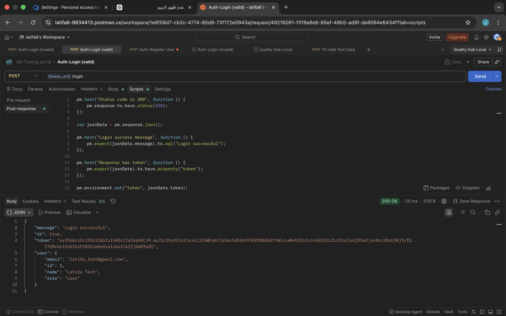
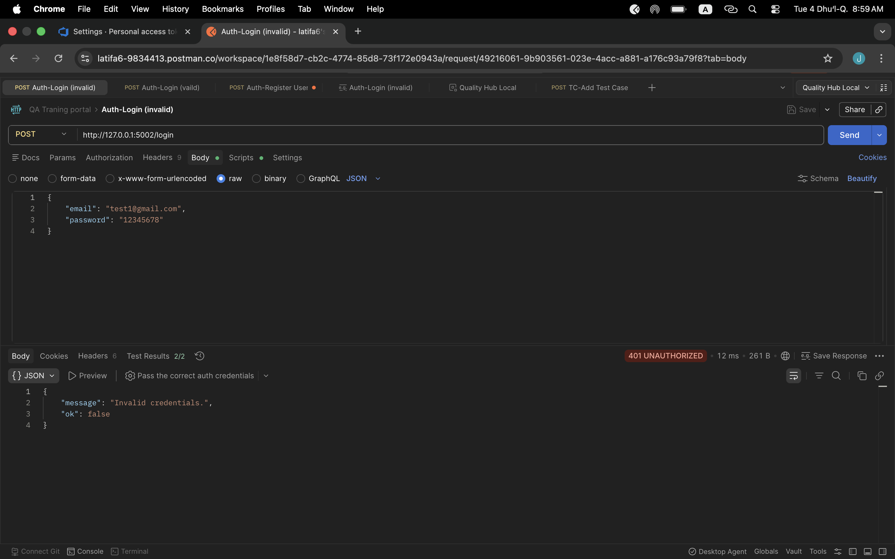
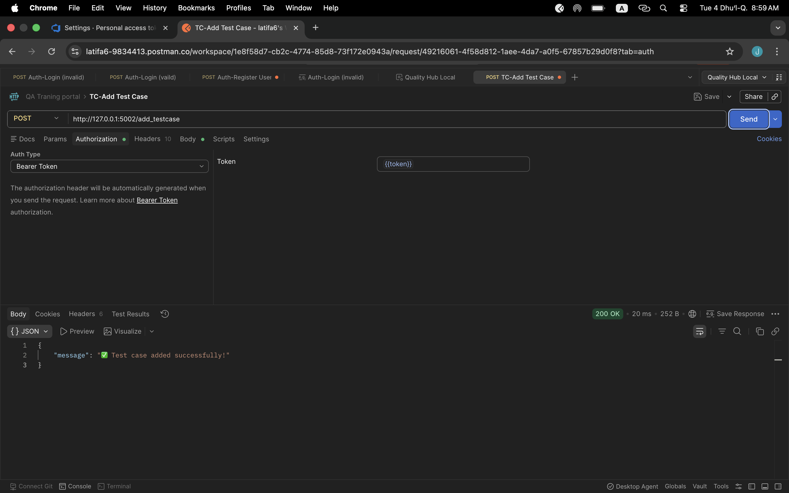
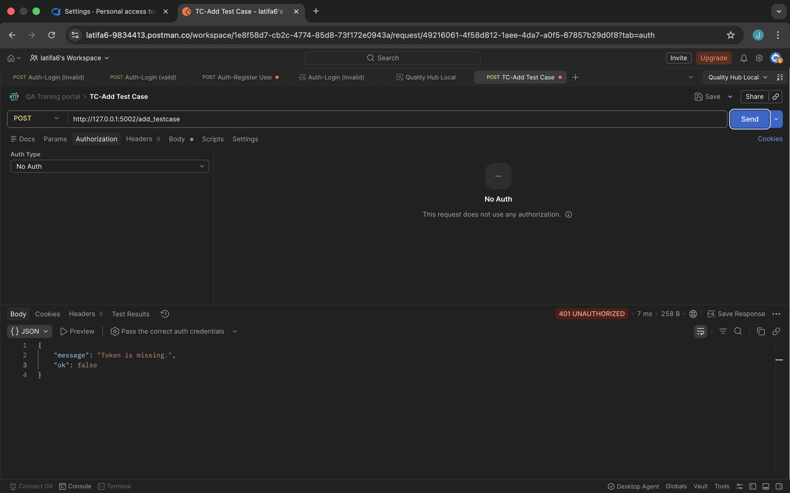

# Quality Hub

Quality Hub is a web-based QA Training Portal that simulates real-world testing tasks.  
It allows users to practice test case design, bug reporting, and QA workflows through a simple backend API.

---

## Features

- User Authentication (Register / Login)
- JWT-based Authentication
- Role-based Access (User / Admin)
- Test Cases Management (Add / Edit / Delete)
- Bug Reporting System
- Admin Review System
- API Testing using Postman

---

## Security

The application uses JSON Web Tokens (JWT) for securing API endpoints.

- A token is generated after successful login
- Protected endpoints require a valid Bearer Token
- Requests without token return 401 Unauthorized
- Expired or invalid tokens are handled properly

---

## API Testing

API testing was performed using Postman with the following scenarios:

- Valid login returns 200 OK
- Invalid login returns 401 Unauthorized
- Authorized requests with token succeed
- Unauthorized requests without token are rejected

---

## Screenshots

### Login Success


### Invalid Login


### Add Test Case with Token


### Request Without Token


---

## Technologies Used

- Python (Flask)
- SQLite
- PyJWT
- Postman

---

## How to Run

```bash
pip install -r requirements.txt
python app.py
